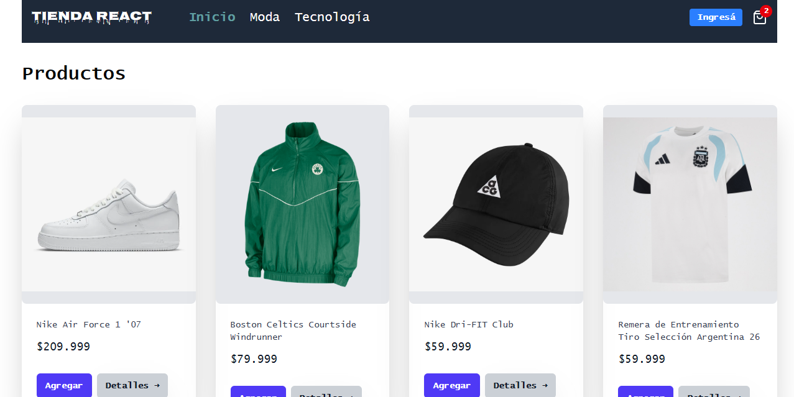

# Tienda React
Tienda React es una aplicación en donde te permite crear, listar, editar o eliminar productos.

## :hammer: Funcionalidades
La página web tiene campos para la inserción de datos de productos y para el listado. A su vez, el usuario puede elegir si quiere eliminar el producto y el resultado se muestra en pantalla.

## :triangular_flag_on_post: Secciones

-  **Inicio:** Esta sección es donde se visualizan los productos existentes. Cada producto se presenta en una tarjeta (card).
-  **Admin:** En esta sección, se encuentra un formulario que permite agregar, editar o eliminar productos. Contiene tres campos de entrada para el nombre del producto, el precio, URL de la imagen y descripción del Producto, incluye un contenedor de botones con un botón de "Actualizar" o "Agregrar".
-  **Carrito:** En esta sección, se encuentra listados todos los productos que agrego al carrito.
 

## :pencil2: Implementación de la MockAPI
Se utilizó una MockAPI que simula una API REST. 
Permite desarrollar y probar aplicaciones frontend sin necesidad de una API real. **Facilita la creación rápida de endpoints para realizar operaciones CRUD (Crear, Leer, Actualizar, Eliminar) y simular respuestas de servidor, lo que agiliza el desarrollo de aplicaciones web.** Es útil para prototipado rápido, pruebas de concepto y desarrollo frontend independiente del backend.

Para eso, **cree desde https://mockapi.io/ un nuevo proyecto para luego poder importar la API en donde se encuentran todos los productos guardados y así poder hacer el consumo de esta API.**

##  :computer: Tecnologías utilizadas
Para la realización de este proyecto he utilizando:

-  **React** 
-  **Tailwindcss** 

## :pushpin: Acceso al proyecto

Puedes acceder al código fuente del proyecto [aquí](https://react-tienda-nu.vercel.app/)